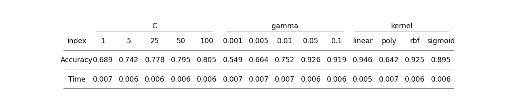
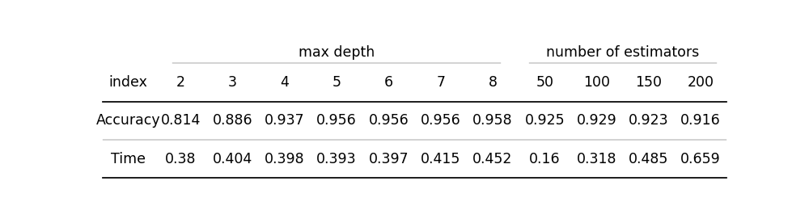
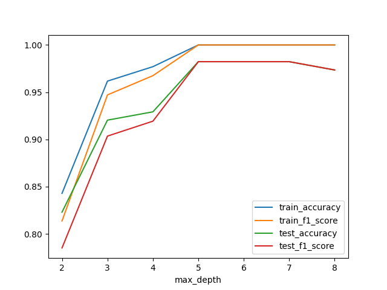
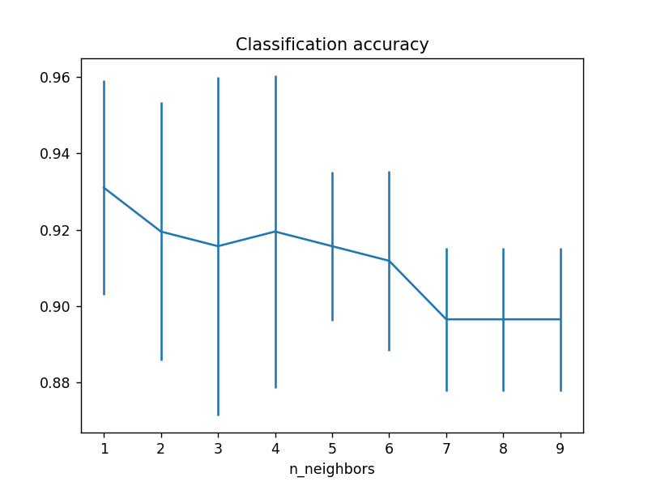

# :zzz: Predicting Quality of Sleep

## :pushpin: Purpose of the work
In my work I would like to compare a Multiple Linear Regression with Machine Learning models like K-Nearest Neighbors, Support Vector Machines and Random Forest.

## :small_blue_diamond: EDA - Exploratory data analysis

The dateset contains 12 columns and 374 columns. Column designated *Sleep Disorder* contains NaN values, however, upon printing the unique values for this column, it can be concluded that the individual in question does not suffer from a sleep disorder. The remaining columns do not exhibit any instances of missing data. The second issue is the presentation of the blood pressure data, which is currently presented in a single column and has the data type object. It would be more appropriate to split this data into two columns, one for systolic and one for diastolic blood pressure, with the data types integer for both.

| Column                             | Data Type      | Description                                                                 |
|------------------------------------|----------------|-----------------------------------------------------------------------------|
| Gender                             | Object         | The gender of the person (Male/Female).                                    |
| Age                                | Int64          | The age of the person in years.                                            |
| Occupation                         | Object         | The occupation or profession of the person.                                |
| Sleep Duration (hours)             | Float64        | The number of hours the person sleeps per day.                             |
| Quality of Sleep (scale: 1-10)     | Int64          | A subjective rating of the quality of sleep, ranging from 1 to 10.         |
| Physical Activity Level (minutes/day) | Int64       | The number of minutes the person engages in physical activity daily.       |
| Stress Level (scale: 1-10)         | Int64          | A subjective rating of the stress level experienced by the person, from 1 to 10. |
| BMI Category                       | Object         | The BMI category of the person (e.g., Underweight, Normal, Overweight).    |
| Blood Pressure (systolic/diastolic)| Object         | The blood pressure measurement, indicated as systolic over diastolic pressure. |
| Heart Rate (bpm)                   | Int64          | The resting heart rate of the person in beats per minute.                  |
| Daily Steps                        | Int64          | The number of steps the person takes per day.                              |
| Sleep Disorder                     | Object         | The presence or absence of a sleep disorder (None, Insomnia, Sleep Apnea). |

The data set includes working individuals across a range of age groups, with a minimum age of 27 and a maximum age of 59. The majority of the subjects reported having good quality sleep. The prevalence of individuals reporting a quality of sleep equal to or greater than 6 is 75%. Furthermore, 25% of the respondents indicated a quality of sleep equal to or greater than 8. In contrast, the distribution of values in the 'Stress level' category is more uniform, with a median score of 5. High level of stress is understandable, because most of responders are nurse and doctors, who have a high level of responsibility in their roles. The majority of the current population leads a healthy lifestyle, with the vast majority engaging in at least 30 minutes of physical activity on a daily basis and half of them exceeding the recommended 7,000 steps per day. Furthermore, the data concerning heart rate and blood pressure are also representative of a positive outcome. Nevertheless, nearly half of the respondents reported some form of sleep disorder.
Prior to the construction of a model, an investigation into the correlation matrix will also be conducted.

The most significant influence on sleep quality is stress level and heart rate. A reduction in stress levels or heart rate is associated with an improvement in sleep quality. In the case of regression, a correlation below 60% is optimal, whereas in the case of clustering or PCA, a high correlation is advantageous. Among all occupations, engineers are observed to have the best quality of sleep, while salespersons and doctors are found to have the poorest. As previously stated, a value of "None" indicates that the individual does not have a sleep disorder. This variable has a strong negative correlation with blood pressure variables and BMI category. This suggests that individuals with the lowest blood pressure and those with a lower BMI are more likely to not have a sleep disorder.

## :small_blue_diamond: Multiple reggresion models

### :small_blue_diamond: First model

In the first model I add four interaction terms:
* Heart Rate * Sleep Duration
* Heart Rate * Stress Level
* Daily Steps * Physical Activity Level
* Diastolic * Systolic

| Variable                            | Coef       | Std Err       | t       | P>abs(t)  |
|-------------------------------------|------------|---------------|---------|-------|
| Intercept                           | -30.146100 | 9.545000e+00  | -3.158  | 0.002 |
| Gender (Male)                       | -0.243700  | 6.400000e-02  | -3.783  | 0.000 |
| Age                                 | 0.036100   | 5.000000e-03  | 7.262   | 0.000 |
| Sleep Duration                      | 5.670800   | 8.860000e-01  | 6.399   | 0.000 |
| Physical Activity Level             | 0.052200   | 7.000000e-03  | 7.444   | 0.000 |
| Stress Level                        | 3.362600   | 4.640000e-01  | 7.250   | 0.000 |
| BMI Category (Overweight)           | -0.563400  | 6.800000e-02  | -8.274  | 0.000 |
| Heart Rate                          | 0.741600   | 1.180000e-01  | 6.286   | 0.000 |
| Daily Steps                         | 0.000400   | 4.840000e-05  | 9.049   | 0.000 |
| Sleep Disorder (None)               | 0.252900   | 5.100000e-02  | 4.995   | 0.000 |
| Sleep Disorder (Sleep Apnea)        | 0.176800   | 5.900000e-02  | 2.993   | 0.003 |
| Systolic                            | -0.077900  | 3.800000e-02  | -2.070  | 0.040 |
| Diastolic                           | -0.394500  | 7.600000e-02  | -5.188  | 0.000 |
| Heart Rate:Sleep Duration           | -0.076800  | 1.300000e-02  | -5.983  | 0.000 |
| Heart Rate:Stress Level             | -0.050700  | 7.000000e-03  | -7.631  | 0.000 |
| Daily Steps:Physical Activity Level | -0.000007  | 8.520000e-07  | -7.951  | 0.000 |
| Diastolic:Systolic                  | 0.002100   | 1.000000e-03  | 4.291   | 0.000 |

### :small_blue_diamond: Second model

For the second model I add squared variables to also take into account the non-linear correlation between the data.

| Variable                            | Coef       | Std Err       | t       | P>abs(t)  |
|-------------------------------------|------------|---------------|---------|-------|
| Intercept                           | -93.260000 | 1.052300e+01  | -8.863  | 0.000 |
| Gender (Male)                       | -0.397600  | 5.800000e-02  | -6.815  | 0.000 |
| Age                                 | 0.109300   | 2.100000e-02  | 5.276   | 0.000 |
| Sleep Duration                      | 11.305900  | 1.451000e+00  | 7.791   | 0.000 |
| Physical Activity Level             | 0.029500   | 9.000000e-03  | 3.405   | 0.001 |
| Stress Level                        | 3.738800   | 4.280000e-01  | 8.736   | 0.000 |
| BMI Category (Overweight)           | -0.423300  | 6.300000e-02  | -6.748  | 0.000 |
| Heart Rate                          | 1.478900   | 1.340000e-01  | 11.001  | 0.000 |
| Daily Steps                         | 0.000600   | 5.910000e-05  | 10.185  | 0.000 |
| Sleep Disorder (None)               | 0.105500   | 4.100000e-02  | 2.554   | 0.011 |
| Systolic                            | -0.805800  | 2.230000e-01  | -3.610  | 0.000 |
| Diastolic                           | 1.021200   | 2.620000e-01  | 3.893   | 0.000 |
| Heart Rate:Sleep Duration           | -0.087100  | 1.200000e-02  | -7.146  | 0.000 |
| Heart Rate:Stress Level             | -0.057700  | 6.000000e-03  | -9.550  | 0.000 |
| Daily Steps:Physical Activity Level | -0.000008  | 9.760000e-07  | -8.384  | 0.000 |
| Diastolic:Systolic                  | -0.177500  | 1.600000e-02  | -11.373 | 0.000 |
| Age²                                | -0.001000  | 0.000000e+00  | -4.134  | 0.000 |
| Sleep Duration²                     | -0.339800  | 6.200000e-02  | -5.515  | 0.000 |
| Physical Activity Level²            | 0.000200   | 7.420000e-05  | 2.867   | 0.005 |
| Heart Rate²                         | -0.004000  | 1.000000e-03  | -4.525  | 0.000 |
| Systolic²                           | 0.062000   | 5.000000e-03  | 11.412  | 0.000 |
| Diastolic²                          | 0.127900   | 1.100000e-02  | 11.492  | 0.000 |

### :small_blue_diamond: Third model

In the third and final model, the VIF (variance inflation factor) is also examined. This factor is used to identify the correlation between two, three, or more variables that is not apparent in the correlation matrix. This issue is named multicollinearity. The minimum value of vif is 1 and that's mean there is no collinearity. Acceptable value is less than 5-10 and in my work I created set of featers which vif was below 10.

| Variable                        | Coef   | Std Err  | t       | P>abs(t)  |
|---------------------------------|--------|----------|---------|-------|
| Intercept                       | 8.4787 | 0.149000 | 56.849  | 0.000 |
| Gender (Male)                   | 0.3728 | 0.049000 | 7.551   | 0.000 |
| Stress Level                    | -0.4740 | 0.015000 | -32.323 | 0.000 |
| BMI Category (Obese)            | -0.9878 | 0.151000 | -6.562  | 0.000 |
| BMI Category (Overweight)       | -0.7019 | 0.069000 | -10.149 | 0.000 |
| Sleep Disorder (None)           | 0.3537 | 0.070000 | 5.038   | 0.000 |
| Sleep Disorder (Sleep Apnea)    | 0.2930 | 0.064000 | 4.564   | 0.000 |
| Age²                            | 0.0007 | 0.000041 | 16.325  | 0.000 |

### :small_blue_diamond: Model based on PCA variables

The first component is influenced primarily by variables: Sleep Duration, Age, and Manager. The second component exhibits a significant impact from the variables Scientist and Accountant, in addition to Sleep Duration. The third component is also influenced by Sleep Duration, along with the variables Teacher and Software Engineer. Three variables: 'None' (indicating the absence of sleep disorders), 'Sleep Apnea', and 'BMI Category', do not have any influence on the first six components.

| Variable  | Coef   | Std Err | t       | P>abs(t)  |
|-----------|--------|---------|---------|-----------|
| Intercept | 7.3113  | 0.020   | 364.179 | 0.000 |
| PCA1      | -0.0991 | 0.008   | -11.744 | 0.000 |
| PCA2      | 0.5033  | 0.009   | 54.528  | 0.000 |
| PCA3      | 0.0358  | 0.012   | 3.064   | 0.002 |
| PCA4      | -0.1813 | 0.014   | -13.270 | 0.000 |

## :small_blue_diamond: Machine Learning

### :small_blue_diamond: SVM

One-vs-one

The biggest difference between accurancy is in gamma parameters. Small values have accurancy arround 0.6-0.7. In comparison the highest accurancy for 0.05 is euqal 0.94. Similar situation is in case of C parametr, because for higher value there is better accurancy. In contrast, in the case of the kerenl, different parameters have quite similar results, but polynomial kernel have definitely the worst results, even changing the degree does not help.

One-vs-rest

The conclusions drawn in this study bear a strong resemblance to those previously outlined in the extant literature. For the C and gamma parameters, it was demonstrated that an increase in value resulted in a corresponding improvement in outcome. Also, the polynomial model obtained the worst results in terms of the kernel parameter. I supposed bigger difference in time between one-vs-one and one-vs-rest models, but probably dataset is too small to see the difference.In summary, the SVM models attained an accuracy and an f1 score of 96%.

### :small_blue_diamond: Random Forest

At the depth of tree euqal 5 there is no improvment in train and test data. 
At the depth of tree euqal 8 model is overfitted, because accurancy and F1 Score is getting worst.

### :small_blue_diamond: KNN
The numbers of neighbors that give the best accuracy are equal to one. This method is called "Nearest Neighbors" because it only considers one point.

## :small_blue_diamond: Model comparison
The best results are from a machine learning model, particular - Random Forest. It has an accuracy and an F1 score of 98%, which is a very good score.

<table>
  <thead>
    <tr>
      <th></th>
      <th colspan="3" style="text-align:center;">Machine Learning</th>
      <th colspan="4" style="text-align:center;">Linear Regression</th>
    </tr>
    <tr>
      <th></th>
      <th>SVM</th>
      <th>Random Forest</th>
      <th>KNN</th>
      <th>Model 1</th>
      <th>Model 2</th>
      <th>Model 3</th>
      <th>Model PCA</th>
    </tr>
  </thead>
  <tbody>
    <tr>
      <td>Accuracy</td>
      <td>0.955752</td>
      <td>0.982301</td>
      <td>0.946903</td>
      <td>0.610619</td>
      <td>0.575221</td>
      <td>0.504425</td>
      <td>0.504425</td>
    </tr>
    <tr>
      <td>F1 Score</td>
      <td>0.955428</td>
      <td>0.982269</td>
      <td>0.945897</td>
      <td>0.637539</td>
      <td>0.608110</td>
      <td>0.526337</td>
      <td>0.529080</td>
    </tr>
  </tbody>
</table>

